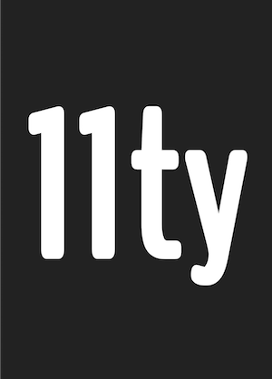

<p align="center"></p>

# eleventy 🕚

A simpler static site generator. An alternative to Jekyll. Written in JavaScript. Transforms a directory of templates (of varying types) into HTML.

Works with HTML, Markdown, Liquid, Nunjucks, Handlebars, Mustache, EJS, Haml, Pug, and JavaScript Template Literals.

## ➡ [Our documentation has moved](https://www.11ty.io/docs/)

## Tests

* Build Status: [](https://travis-ci.org/11ty/eleventy)
* [Code Coverage Statistics](docs/coverage.md)

```
npm run test
```

## Major Roadmapped Features

* [Top Feature Requests](https://github.com/11ty/eleventy/issues?q=label%3Aneeds-votes+sort%3Areactions-%2B1-desc) (Add your own votes using the 👍 reaction)
